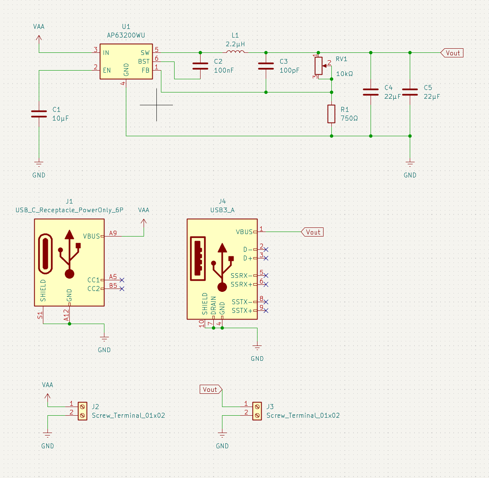
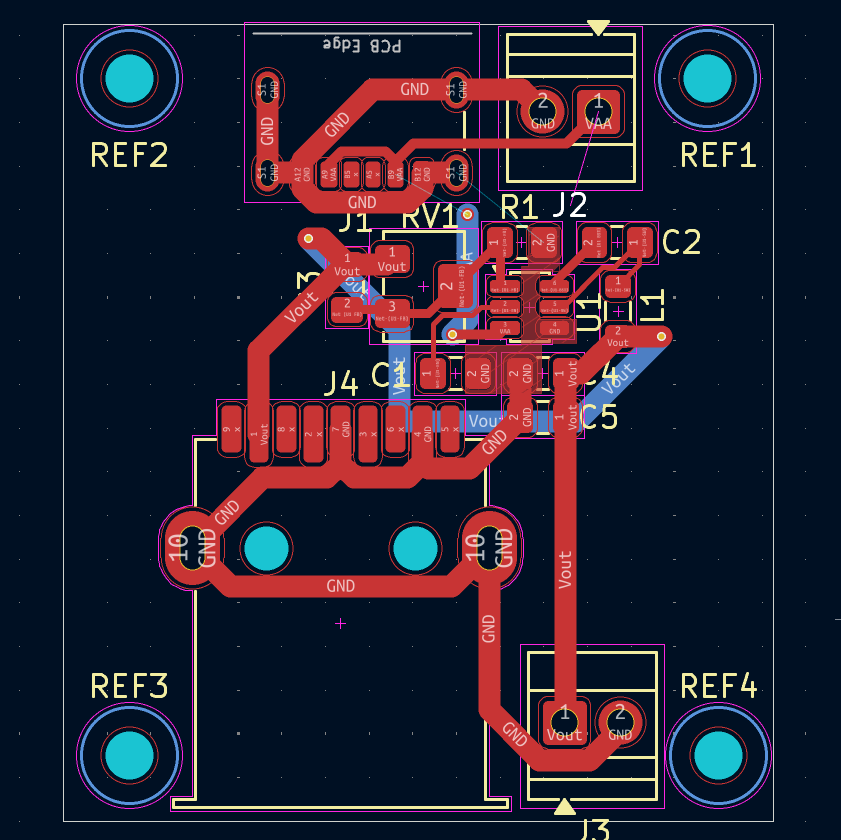
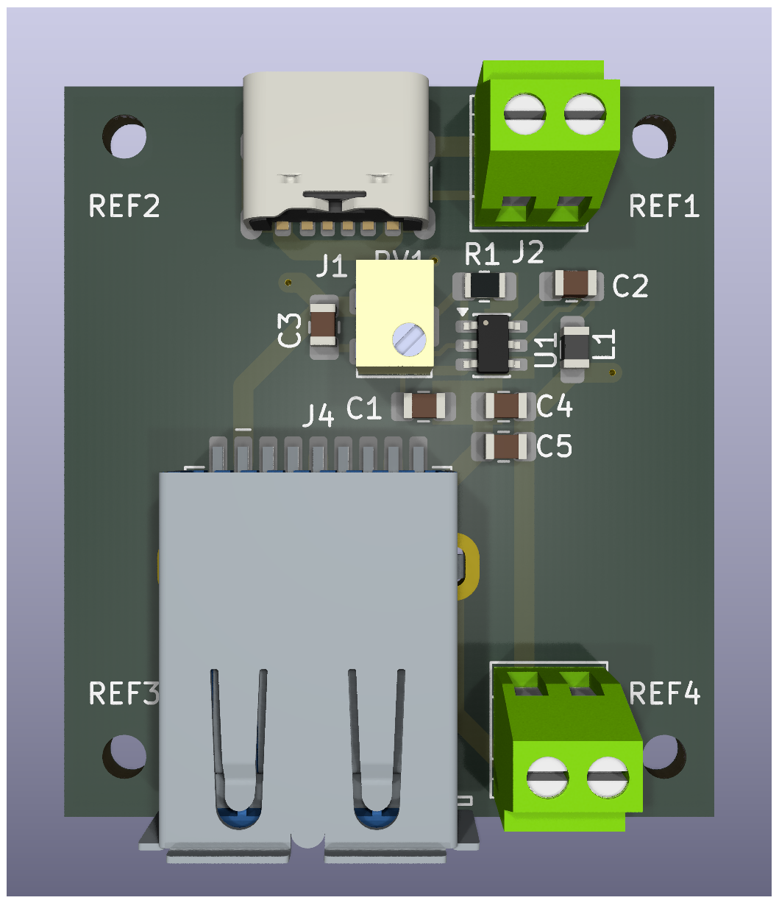

# Variable Buck Converter — KiCad PCB

A variable output synchronous buck converter designed as a practice PCB in KiCad. Takes a USB-C input and delivers a tunable regulated output over USB-A and screw terminals.

---

## Specs

| Parameter | Value |
|---|---|
| Input voltage (Vin) | 0.8V – 12V |
| Output voltage (Vout) | 0.8V – Vin (adjustable) |
| Max output current | 2A |
| Controller IC | AP63200WU (synchronous buck) |
| Input connector | USB-C (power only) |
| Output connector | USB-A + screw terminal |

---

## How it works

The AP63200WU is a synchronous buck regulator. It switches an internal MOSFET at high frequency, and the inductor + output capacitors smooth that into a steady DC output.

Output voltage is set by a resistor divider on the feedback (FB) pin:

```
Vout = 0.8V × (1 + RV1/R1)
```

- **RV1** — 10kΩ trimmer pot (wiper on FB, adjusts output)
- **R1** — 750Ω fixed resistor (sets lower bound)

Turning the pot changes the divider ratio, which changes Vout. The IC regulates to keep FB at 0.8V (internal reference).

---

## Schematic overview

```
USB-C (J1) ──► VAA ──► U1 (AP63200WU) ──► L1 (2.2µH) ──► Vout
                         │                                    │
                        C1                          C2, C3, C4, C5, RV1, R1
                      (10µF)               (snubber, bulk caps, feedback divider)

Vout ──► USB-A (J4)
Vout ──► Screw terminal (J3)
VAA  ──► Screw terminal (J2)
```

---

## Key design decisions

- **Snubber cap (C2 — 100nF, C3 — 100pF on SW node)** — damps ringing on the switching node, reduces EMI
- **Dual 22µF output caps (C4, C5)** — bulk capacitance for low output ripple
- **10µF input cap (C1)** — decouples the input supply
- **USB-C power-only footprint** — CC pins left unconnected (no PD negotiation, passive 5V input assumed)
- **Feedback net (Net-U1-FB) kept short** — sensitive node, routed away from the SW node to avoid noise coupling

---

## Project files

| File | Description |
|---|---|
| `buck_convertor.kicad_pro` | KiCad project file |
| `buck_convertor.kicad_sch` | Schematic |
| `buck_convertor.kicad_pcb` | PCB layout |
| `buck_convertor.kicad_prl` | Local project settings |

---

## Images

> Add your schematic, PCB routing, and 3D render screenshots to an `/images` folder and link them below.

| Schematic | PCB Routing | 3D Render |
|---|---|---|
|  |  |  |

---

## Tools used

- [KiCad 9.0](https://www.kicad.org/) — schematic capture & PCB layout

---

## Status

Practice / draft — not manufactured or tested. Layout is functional but not optimised for production (ground plane, thermal relief, DRC cleanup still pending).

---

## License

MIT — feel free to use, fork, or build on this.
